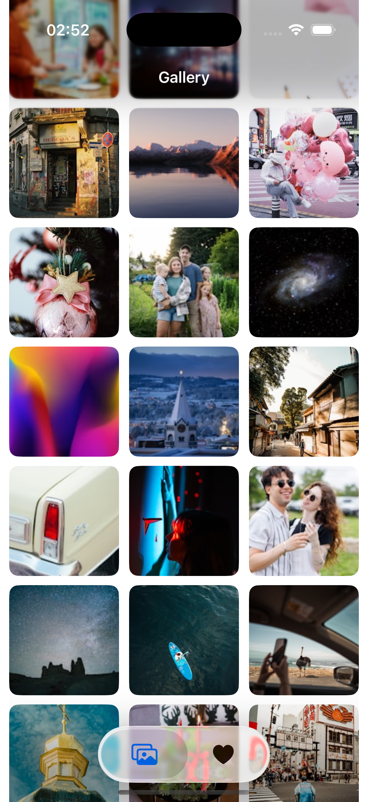
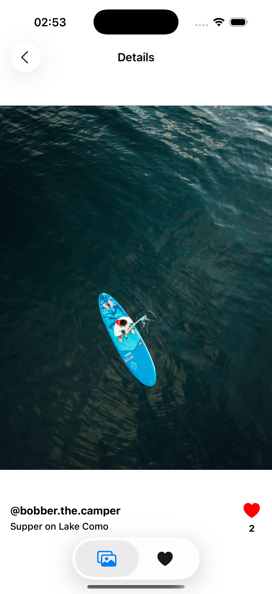
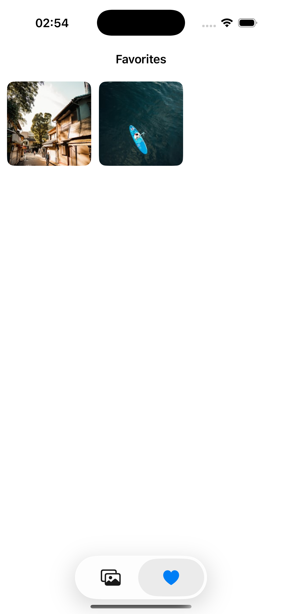

### Project Overview
**Author:** Pavel Bychkowski  
**Contact:** tg @playerz0redd

This application is a mobile image gallery developed as a test task for an Intern position. It allows users to browse high-quality images from the Unsplash API, view detailed information, and manage a list of favorite photos.  

### Key Features & Assumptions
I implemented several features beyond the basic requirements to ensure a smooth user experience:
*   **Infinite Scrolling:** Implemented pagination that automatically loads new images as the user scrolls to the bottom of the grid.
*   **Smart Image Caching:** Custom **in-memory caching** using **NSCache** to minimize network requests and ensure instant loading of previously viewed photos.
*   **Offline Favorites:** Liked photos are persisted locally using **Core Data**, allowing users to access their favorite content even after restarting the app.
*   **Interactive UI:** Added scale animations when liking a photo in the detail view.
*   **Robust Error Handling:** A centralized error handling system based on a custom `AppError` enum. Errors from the Network and Database layers are propagated to the ViewModel and gracefully displayed to the user via native alerts, preventing silent failures.

### Technical Overview & Solutions
The project is built using **Swift** and **UIKit**.

#### Architecture
*   **MVVM (Model-View-ViewModel):** strictly separates business logic (`GalleryViewModel`) from the UI (`GalleryViewController`). Data binding is implemented via **Closures**.
*   **Builder Pattern:** The `GalleryModuleBuilder` creates view controllers and injects dependencies, ensuring loose coupling.
*   **Service Layer (Facade):** A `PhotoService` acts as a central hub, orchestrating data flow between the **NetworkManager**, **CoreDataManager**, and **CachingManager**.
*   **Strategy Pattern:** The `PhotoService` relies on the `IModelProvider` abstraction. This allows the app to dynamically switch strategies between fetching data from the **API** (for the Feed) and **Core Data** (for Favorites) without changing the service logic.

#### Technologies & Frameworks
*   **UIKit:** Fully **programmatic AutoLayout** using `NSLayoutConstraint` (No Storyboards/XIBs for main flows).
*   **Swift Concurrency:** Extensive use of **async/await**, **Task**, **TaskGroup**, and **MainActor** for handling asynchronous network calls and parallel image fetching.
*   **Core Data:** Native framework used for persisting favorite images (`PhotoEntity`) locally.
*   **URLSession:** Native networking for REST API calls.
*   **NSCache:** efficient image caching mechanism.
*   **Codable:** used for parsing JSON responses.
*   **xcconfig:** used for securely managing the API Token.

#### Protocols & Patterns
*   **Dependency Injection (DI):** All dependencies are injected via initializers.
*   **Singleton:** Used for `CoreDataManager` and `CachingManager` to ensure a single source of truth.
*   **Repository / Provider Protocols:** `IModelProvider`, `IDataPersistance`, and `IDataProvider` abstractions make the system modular and testable.

### Configuration
To run this project, you need to configure the Unsplash API Key:

1.  Navigate to `gallery-app/Application/Secrets.xcconfig`.
2.  Locate the line: `API_TOKEN = ...`.
3.  Replace the value with your valid Unsplash Access Key.
4.  Clean the build folder and run the app.

### Screenshots
|  |  |  |
